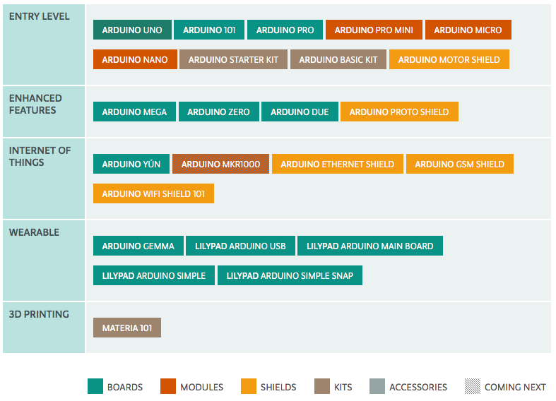
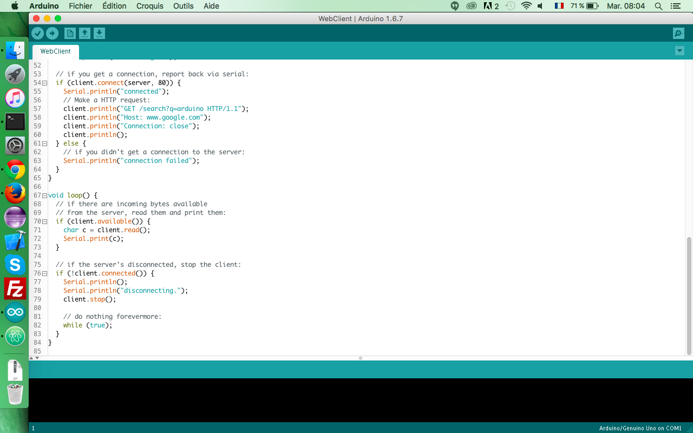
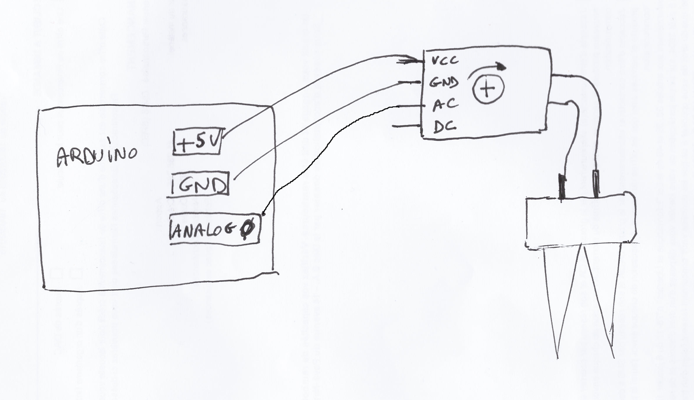
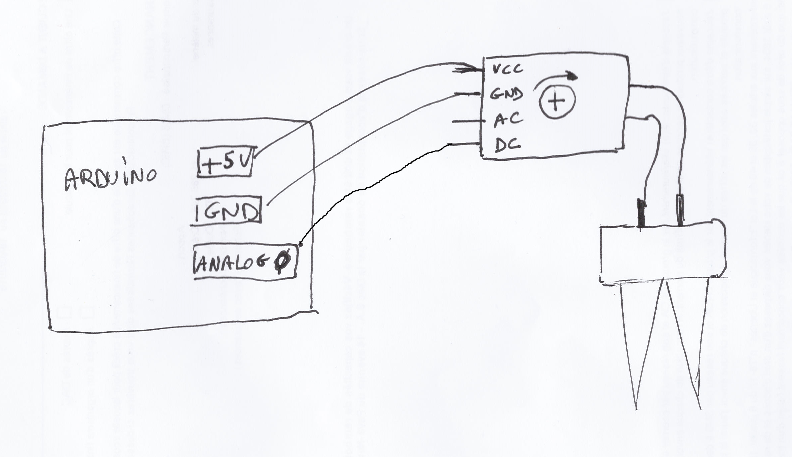
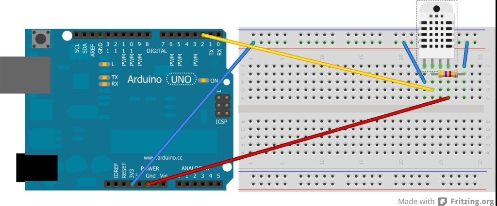

= Arduino: cas concret
Naël MSKINE

== Qu'est-ce que c'est ?
=== Qu'est-ce que c'est ? (1/3)
* Arduino est une carte programmable materiellement libre.
* Possède:
** Des E/S numériques
** Des E/S analogiques
* Programmable via un éditeur

=== Qu'est-ce que c'est ? (2/3)

=== Qu'est-ce que c'est ? (3/3)

== Conseils pour démarrer
* Acheter un kit de démarrage:
** Carte Arduino
** Résistances
** DEL (LED)
** Capteurs divers
** Câbles Dupont
* Multimètre
* Réviser ses cours d'électricité !

== Exemples
=== Exemple 1: Hello World

=== Exemple 2: Capteur d'humidité (1/2)

=== Exemple 2: Capteur d'humidité (2/2)

=== Exemple 3: Capteur DHT22 (1/2)

* Mesure:
** Température air
** Pourcentage d'humidité de l'air
* Librairie peut calculer la température ressentie

=== Exemple 3: Capteur DHT22 (2/2)

== Mon projet

=== Equipements existants
* Récupérateur d'eau pluviales (550 Litres)
* Robinet avec eau courante
* Environ 35 m^2^ de carrés potagers

=== Première idée
Pompe d'aquarium

=== Etape n°1
* 1 capteur d'humidité
* 1 capteur de température
* Date / heure système
* 1 relai
* 1 Electrovanne

_Branché sur le robinet d'eau courante_

=== Améliorations (1 / 2)
* Surpresseur
* Remplissage du récupérateur lorqu'il n'y a plus assez d'eau
** Détecteur de niveau de cuve (flotteur + capteur de distance?)
** Réutilisation de l'électrovanne
* Augmenter la capicité de stockage d'eaux pluviales

=== Améliorations (2 / 2)
* Ajout module Wifi
** Récupération des données météo pour prévoir
** Envoi des données sur un serveur

== Conclusion
* Code ultra simple
* Exemples par milliers
* Partie életronique plus compliquée
* Base bricolage obligatoire
